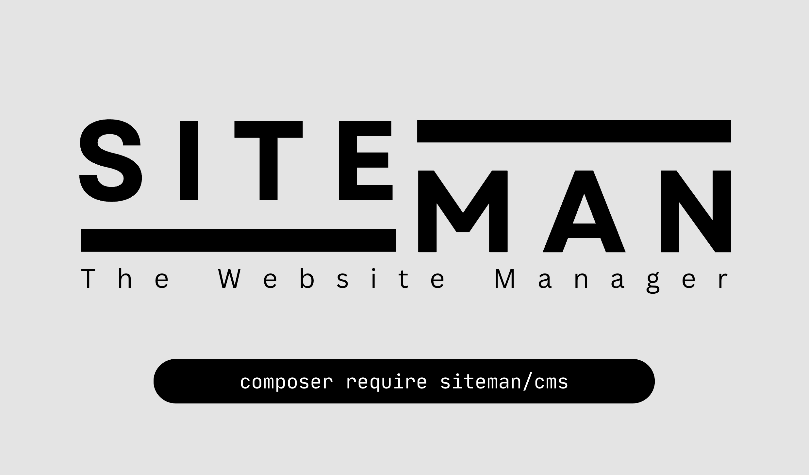
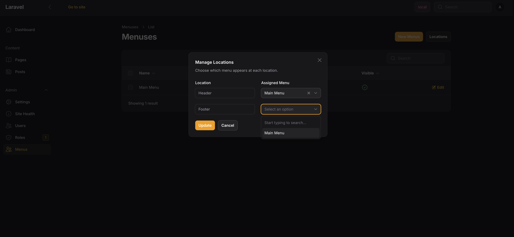
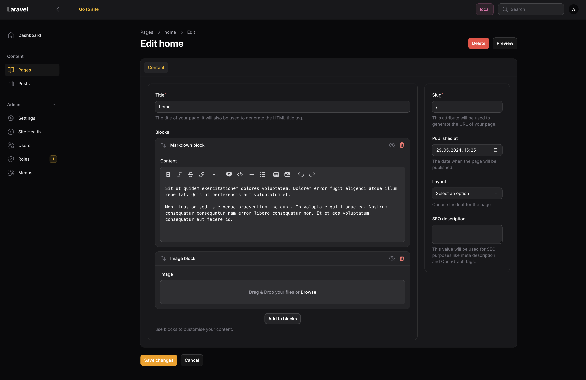
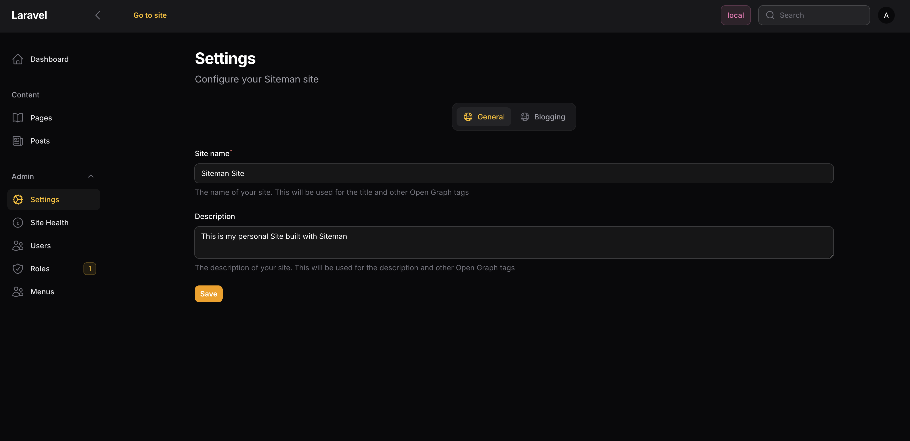
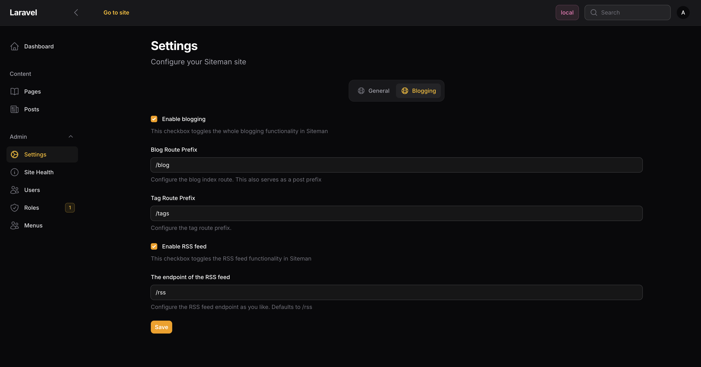

# Siteman - the Website Manager

[](https://packagist.org/packages/siteman/cms)
[](https://github.com/siteman-io/cms/actions?query=workflow%3Arun-tests+branch%3Amain)
[](https://codecov.io/gh/siteman-io/cms)
[](https://github.com/siteman-io/cms/actions?query=workflow%3A"Fix+PHP+code+style+issues"+branch%3Amain)
[](https://packagist.org/packages/siteman/cms)



Siteman leverages the power and flexibility of Laravel and Filament to provide a straightforward content management
solution. It serves as a robust foundation for building custom applications, offering a seamless and efficient
development experience.

# Table of Contents

2. [Installation](#installation)
4. [Features](#features)
    1. [Themes](#themes)
    2. [Layouts](#layouts)
    3. [Menus](#menus)
    4. [Blocks](#blocks)
5. [Settings](#settings)
6. [Development](#development)
7. [Testing](#testing)
8. [Changelog](#changelog)
9. [Contributing](#contributing)
10. [Security Vulnerabilities](#security-vulnerabilities)
11. [Credits](#credits)
12. [License](#license)

## Installation

You can install the package via composer:

```bash
composer require siteman/cms
```

You can install Siteman via its own artisan command. It is interactive and will create the first user for you.

```bash
php artisan siteman:install
```

Normally the `siteman:install` command should take care of everything. If you want to install it manually, you can so
by enabling the Siteman plugin in your Filament panel.

```php

## Usage

```php
//...
$panel->plugin(SitemanPlugin::make());
//...
```

## Features

### Themes

Siteman ships with a default BlankTheme, which is not very exciting. But you can easily create your own theme by
executing
`php artisan make:siteman-theme`. This will create a new theme in the `App\Themes` namespace of your application
alongside some basic views to kickstart your theme development.

The theme can be enabled via your `config/siteman.php` file.

```php 
return [
    // ...
    'themes' => [
        \Siteman\Cms\Theme\BlankTheme::class,
    ],
    // ...
];
``` 

A Siteman theme is a PHP class which implements the `Siteman\Cms\Theme\ThemeInterface`. It defines two methods:

#### `getName` method

The `getName` method is used to return a human-readable name of the theme.

#### `configure` method

The Themes `configure` method is used to define the theme's configuration. It gets the `Siteman\Cms\Siteman` instance as
a dependency, which allows for easy access and manipulation of the Siteman configuration.

> [!IMPORTANT]  
> If you are proving a theme via a composer package you need to implement a `getViewPrefix` method.

#### Default view files

Siteman renders different content through different cascades of view options. The first existing one is taken.

* Pages
    1. Layout if set on the Page
    2. `{theme}.pages.{slug}`
    3. `{theme}.pages.show`
    4. `siteman::themes.blank.pages.show`
* Posts
    1. `{theme}.posts.{slug}`
    2. `{theme}.posts.show`
    3. `siteman::themes.blank.posts.show`
* Post Index
    1. `{theme}.posts.index`
    2. `siteman::themes.blank.posts.index`
* Tags
    1. `{theme}.tags.{slug}`
    2. `{theme}.tags.show`
    3. `siteman::themes.blank.tags.show`

### Layouts

Layouts are the wrapper around your content. They define the structure of your page. Siteman ships with a default
`base-layout`. A Layout is nothing more than a Blade component. It will get post or page passed as a `post` property.
A new layout can be registered via your Themes `configure` method.

```php
    public function configure(Siteman $siteman): void
    {
        //...
        $siteman->registerLayout(BaseLayout::class);
    }
```

> [!IMPORTANT]  
> Layouts have to be registered as Blade components by your package/application. This
> is done by calling `Blade::component` method to your package's service provider.

```php

### Menus

Menus are used to define the navigation of your site. Your theme need to provide menu locations. You can define the
locations in your Themes `configure` method.

```php
    public function configure(Siteman $siteman): void
    {
        //...
        $siteman->registerMenuLocation('header', __('menu.header'));
    }
```

Registered menu locations and their assigned menus can be found via the `Locations` action.



Menus can be used in your Blade views via the `Siteman` facade.

```bladehtml

<ul>
    @foreach(\Siteman\Cms\Facades\Siteman::getMenuItems('header') as $item)
    <li><a href="{{$item->url}}" class="hover:underline">>{{$item->title}}</a></li>
    @endforeach
</ul>
```

### Menus

TBD

### Blocks

Blocks are the building blocks of your content. They can be used to create complex layouts. Siteman ships with two
blocks out of the box.



#### `image-block`

The `image-block` which uses the `Spatie\MediaLibrary` under the hood and provides responsive images out of the box.

#### `markdown-block`

The `markdown-block` allows you to write markdown in your content. It uses the `league/commonmark` under the hood.
Siteman enabled a few extensions for it out of the box

* Render blade via `ryangjchandler/commonmark-blade-block`
* Highlight code via `torchlight/torchlight-laravel` (You need to have a `TORCHLIGHT_TOKEN` configured in your `.env`)
* Add HTML attributes via the `AttributesExtension` from `league/commonmark`

#### Create your own blocks

You can create your own blocks by executing `php artisan make:siteman-block`. This will create a new block in the
`App\Blocks` namespace of your application. It will have a dummy field just as an example which you may delete.

```php
<?php declare(strict_types=1);
namespace App\Blocks;

use Filament\Forms\Components\TextInput;
use Illuminate\Contracts\View\View;
use Siteman\Cms\Blocks\BaseBlock;
use Siteman\Cms\Models\Page;

class TitleBlock extends BaseBlock
{
    public function id(): string
    {
        return 'title';
    }

    protected function fields(): array
    {
        return [
            TextInput::make('title'),
        ];
    }

    public function render(array $data, Page $page): View
    {
        return view('blocks.title', ['data' => $data]);
    }
}
```

Additionally, it creates the needed view file to render the Block.

```bladehtml
{{-- `blocks.title.blade.php` --}}

<div class="block">
    <h2>{{ $data['title'] }}</h2>
</div>
```

A block needs to be registered via the Themes `configure` method.

```php
    public function configure(Siteman $siteman): void
    {
        //...
        $siteman->registerBlock(TitleBlock::class);
    }
```

### Settings

Siteman comes with a settings implementation which is built on top of the [
`spatie/laravel-settings` package](https://github.com/spatie/laravel-settings) package. It ships
out of the box with the following Settings:

#### General Settings

The General Settings contain fields to configure the site's name, description.


#### Blog Settings

The Blog Settings contain fields to configure Sitemans blogging capabilities.


#### Create your own settings

You can create your own settings by executing `php artisan make:siteman-settings`. This will create a new settings class
in the `App\Settings` namespace of your application.

```php
<?php declare(strict_types=1);

namespace App\Settings;

use Spatie\LaravelSettings\Settings;

class ThemeSettings extends Settings
{
    /**
     * This property is just an example.
     */
    public ?string $description;

    public static function group(): string
    {
        return 'theme';
    }
}
```

With an additional migration to provision default values:

```php
<?php declare(strict_types=1);

use Spatie\LaravelSettings\Migrations\SettingsMigration;

return new class extends SettingsMigration
{
    public function up(): void
    {
        $this->migrator->add('theme.description', 'Default value');
    }
};
```

You can find out more about how to do this in
the [Spatie documentation](https://github.com/spatie/laravel-settings#usage).

To integrate this into Siteman we also generate a `App\Settings\ThemeSettingsForm` class which is used to define the
fields for the settings form.

```php
<?php declare(strict_types=1);

namespace App\Settings;

use Filament\Forms\Components\Textarea;
use Siteman\Cms\Settings\SettingsFormInterface;

class ThemeSettingsForm implements SettingsFormInterface
{
    public static function getSettingsClass(): string
    {
        return \App\Settings\ThemeSettings::class;
    }

    public function icon(): string
    {
        return 'heroicon-o-globe-alt';
    }

    public function schema(): array
    {
        return [
            Textarea::make('description')->rows(2),
        ];
    }
}
```

It contains the dummy field `description` which you may delete. You can add more fields to the schema to fit your needs.

The settings need to be registered via the Themes `configure` method.

```php
    public function configure(Siteman $siteman): void
    {
        //...
        $siteman->registerSettings(ThemeSettingsForm::class);
    }
```

## Development

We use orchestra/testbench for a proper development experience. To get started you should fork the repository and clone
it. Next you can set up the development environment by executing the following commands:

```bash
composer install
composer prepare
composer serve
```

## Testing

We use pest as our testing framework.

```bash
composer test
```

## Changelog

Please see [CHANGELOG](CHANGELOG.md) for more information on what has changed recently.

## Contributing

Please see [CONTRIBUTING](CONTRIBUTING.md) for details.

## Security Vulnerabilities

Please review [our security policy](../../security/policy) on how to report security vulnerabilities.

## Credits

- [bambamboole](https://github.com/bambamboole)
- [All Contributors](../../contributors)
- [datlechin/filament-menu-builder](https://github.com/datlechin/filament-menu-builder) I learned so much about Filament
  by reimplementing this package.

## License

The MIT License (MIT). Please see [License File](LICENSE.md) for more information.
