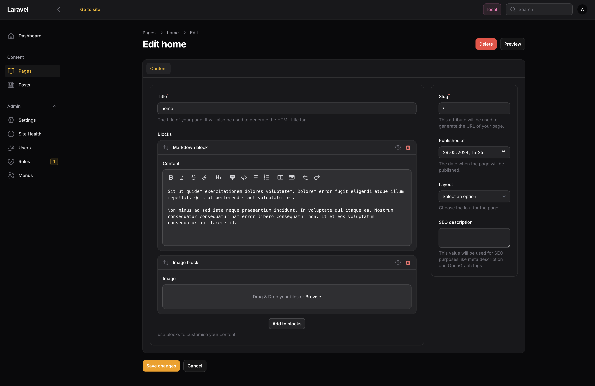

# Blocks
Blocks are the building blocks of your content. They can be used to create complex layouts. Siteman ships with two
blocks out of the box.



## `image-block`

The `image-block` which uses the `Spatie\MediaLibrary` under the hood and provides responsive images out of the box.

## `markdown-block`

The `markdown-block` allows you to write markdown in your content. It uses the `league/commonmark` under the hood.
Siteman enabled a few extensions for it out of the box

* Render blade via `ryangjchandler/commonmark-blade-block`
* Highlight code via `torchlight/torchlight-laravel` (You need to have a `TORCHLIGHT_TOKEN` configured in your `.env`)
* Add HTML attributes via the `AttributesExtension` from `league/commonmark`

## Create your own blocks

You can create your own blocks by executing `php artisan make:siteman-block`. This will create a new block in the
`App\Blocks` namespace of your application. It will have a dummy field just as an example which you may delete.

```php
<?php declare(strict_types=1);
namespace App\Blocks;

use Filament\Forms\Components\TextInput;
use Illuminate\Contracts\View\View;
use Siteman\Cms\Blocks\BaseBlock;
use Siteman\Cms\Models\Page;

class TitleBlock extends BaseBlock
{
    public function id(): string
    {
        return 'title';
    }

    protected function fields(): array
    {
        return [
            TextInput::make('title'),
        ];
    }

    public function render(array $data, Page $page): View
    {
        return view('blocks.title', ['data' => $data]);
    }
}
```

Additionally, it creates the needed view file to render the Block.

```bladehtml
{{-- `blocks.title.blade.php` --}}

<div class="block">
    <h2>{{ $data['title'] }}</h2>
</div>
```

A block needs to be registered via the Themes `configure` method.

```php
    public function configure(Siteman $siteman): void
    {
        //...
        $siteman->registerBlock(TitleBlock::class);
    }
```
