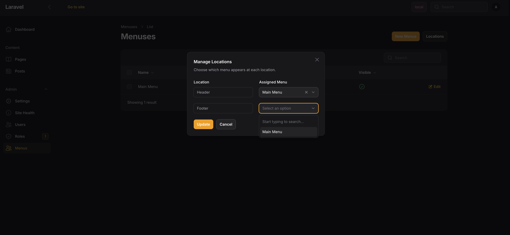

# Menus

Menus let you build navigation that editors can manage in the admin. You define locations in your theme, then editors can create menus and assign them.

## Menu Locations

Register locations in your theme:

```php
public function configure(Siteman $siteman): void
{
    $siteman->registerMenuLocation('header', 'Header Navigation');
    $siteman->registerMenuLocation('footer', 'Footer Navigation');
}
```



## Menu Item Types

- **Page Link** - Links to a Siteman page. URL updates automatically if the page slug changes.
- **Custom Link** - Any URL you want.
- **Custom Text** - Just text, no link (useful for section headers).

Items can be nested for dropdowns.

## Displaying Menus

```blade
@foreach(\Siteman\Cms\Facades\Siteman::getMenuItems('header') as $item)
    <a href="{{ $item->url }}">{{ $item->title }}</a>
@endforeach
```

With nested items:

```blade
@foreach(\Siteman\Cms\Facades\Siteman::getMenuItems('header') as $item)
    <li>
        <a href="{{ $item->url }}">{{ $item->title }}</a>

        @if($item->children->count())
            <ul>
                @foreach($item->children as $child)
                    <li><a href="{{ $child->url }}">{{ $child->title }}</a></li>
                @endforeach
            </ul>
        @endif
    </li>
@endforeach
```

## Menu Item Properties

Each item has:
- `title` - Display text
- `url` - The link (null for text items)
- `target` - Link target (`_blank`, etc.)
- `children` - Collection of nested items

## Related

- [Themes](/features/themes)
