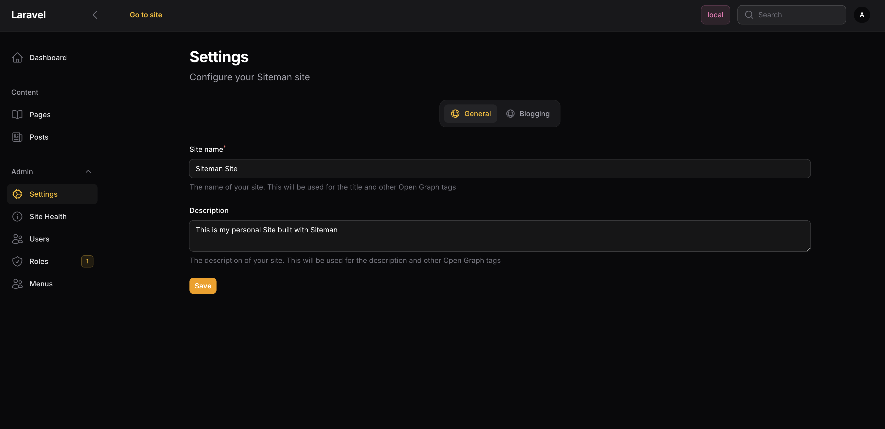

# Settings

Siteman comes with a settings implementation which is built on top of the [
`spatie/laravel-settings` package](https://github.com/spatie/laravel-settings) package. It ships
out of the box with the following Settings:

## General Settings

The General Settings contain fields to configure the site's name, description.


## Create your own settings

You can create your own settings by executing `php artisan make:siteman-settings`. This will create a new settings class
in the `App\Settings` namespace of your application.

```php
<?php declare(strict_types=1);

namespace App\Settings;

use Spatie\LaravelSettings\Settings;

class ThemeSettings extends Settings
{
    /**
     * This property is just an example.
     */
    public ?string $description;

    public static function group(): string
    {
        return 'theme';
    }
}
```

With an additional migration to provision default values:

```php
<?php declare(strict_types=1);

use Spatie\LaravelSettings\Migrations\SettingsMigration;

return new class extends SettingsMigration
{
    public function up(): void
    {
        $this->migrator->add('theme.description', 'Default value');
    }
};
```

You can find out more about how to do this in
the [Spatie documentation](https://github.com/spatie/laravel-settings#usage).

To integrate this into Siteman we also generate a `App\Settings\ThemeSettingsForm` class which is used to define the
fields for the settings form.

```php
<?php declare(strict_types=1);

namespace App\Settings;

use Filament\Forms\Components\Textarea;
use Siteman\Cms\Settings\SettingsFormInterface;

class ThemeSettingsForm implements SettingsFormInterface
{
    public static function getSettingsClass(): string
    {
        return \App\Settings\ThemeSettings::class;
    }

    public function icon(): string
    {
        return 'heroicon-o-globe-alt';
    }

    public function schema(): array
    {
        return [
            Textarea::make('description')->rows(2),
        ];
    }
}
```

It contains the dummy field `description` which you may delete. You can add more fields to the schema to fit your needs.

The settings need to be registered via the Themes `configure` method.

```php
    public function configure(Siteman $siteman): void
    {
        //...
        $siteman->registerSettings(ThemeSettingsForm::class);
    }
```
